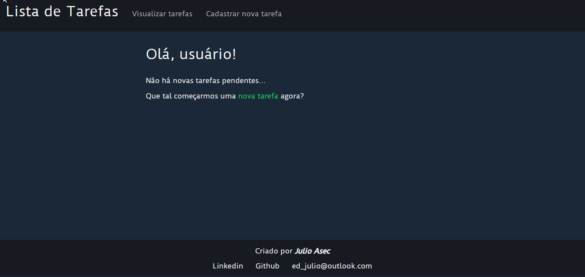
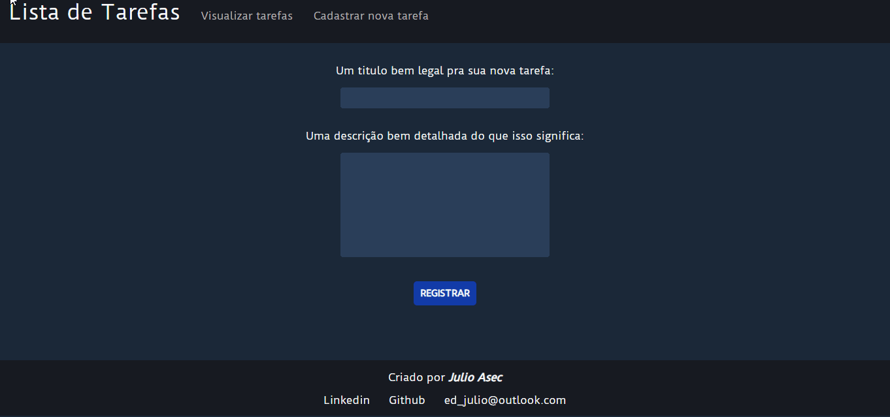
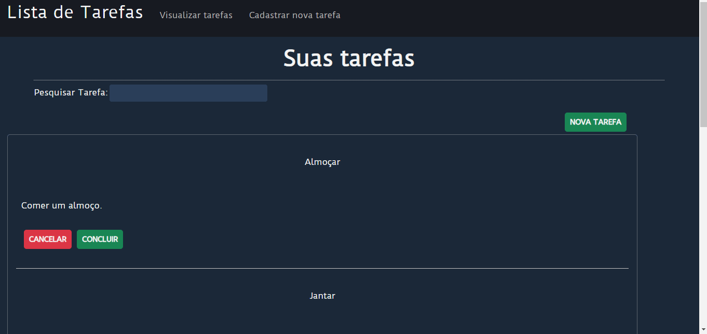

# ⭐ # Lista De Tarefas

Uma SPA em angular. Usada para registrar tarefas(TODO List)

  
# 📖 Instruções de Uso

### Pré Requisitos:

- [Git](https://git-scm.com/)
- [NodeJs](https://nodejs.org/en/)
- Um navegador. 
- [VSCode](https://code.visualstudio.com/)
  
 

Usando um terminal de sua preferência siga as instruções a seguir:

    # Clone o repositório na sua máquina:
    Git clone https://github.com/Julioasec/lista-de-tarefas.git

    # Entre na pasta do projeto:
    cd lista-de-tarefas

    # Instale as dependências do projeto:
    npm install 
    
    # Inicie o servidor de desenvolvimento
    npm run start

    # Acesse o endereço localhost:4200 do seu navegador.

 

# ⚡ Funcionalidades 

- Criar uma nova tarefa.
- Pesquisar por uma tarefa.
- Concluír ou cancelar suas tarefas.

 

## Demonstração:

Clique em nova tarefa e digite uma tarefa qualquer(somente o título é obrigatório).

  

Clique em "Visualizar tarefas" e todas as tarefas pendentes aparecerão.  
Decida se quer cancelar ou concluír uma tarefa.

  

Você também pode pesquisar uma tarefa especifica.

  
 

# 🚩 Sobre
    
## Técnologias Utilizadas:

- [HTML](https://developer.mozilla.org/pt-BR/docs/Web/HTML)  
- [CSS](https://www.w3schools.com/css/)
- [TypeScript](https://www.typescriptlang.org/)
- [JavaScript](https://developer.mozilla.org/pt-BR/docs/Web/JavaScript)
- [Angular](https://angular.io/)
- [Git](https://git-scm.com/) 
- [NodeJs](https://nodejs.org/en/) (npm) 

## Editor de Código:
- [Vscode](https://code.visualstudio.com/)
  
# 🔎 Observações:
 
 - A aplicação utiliza o localhost para salvar as tarefas.
- Cancelar ou concluír uma tarefa não remove ela do localhost. Caso queira limpa-lo aperte "f12" utilizando o navegador e na aba "console" execute o comando localStorage.clear() 
 - Para visualizar o projeto em funcionamento, [https://asec-portfolio-listadetarefas.netlify.app/](https://asec-portfolio-listadetarefas.netlify.app/)
 - Por algum motivo o netlify retorna um erro 404 quando a SPA é acessada por alguma rota(ex: /home), portanto é necessário usar sempre a Url base.
  
****
Criado por ***JULIO ASEC*** 👨🏾‍🦲
[Linkedin](https://www.linkedin.com/in/julio-silva-04b6aa224/) | [Github](https://github.com/Julioasec) | [ed_julio@outlook.com](mailto:ed_julio@outlook.com)
